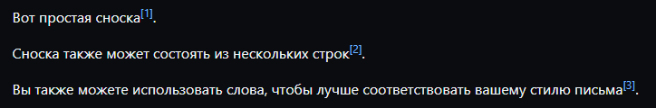

# Markdown-Cheatsheet

Этот материал предназначен как краткий справочник и демонстрация. Для получения более полной информации
см. [оригинальную спецификацию Джона Грубера](http://daringfireball.net/projects/markdown/)
и [Создание документов на GitHub](https://docs.github.com/ru/get-started/writing-on-github).

##### Содержание

[Заголовки](#заголовки)  
[Форматирование](#форматирование)  
[Списки](#списки)  
[Ссылки](#ссылки)  
[Изображения](#изображения)  
[Код и Подсветка Синтаксиса](#код)  
[Сноски](#сноски)  
[Таблицы](#таблицы)  
[Цитаты](#цитаты)  
[Встроенный HTML](#html)  
[Горизонтальная черта](#hr)  
[Разрывы строк](#строки)  
[YouTube Видео](#видео)

<a name="заголовки"/>

## Заголовки

```no-highlight
# H1
## H2
### H3
#### H4
##### H5
###### H6

Альтернативно, для H1 и H2, подчеркнутый стиль:

Alt-H1
======

Alt-H2
------
```

# H1

## H2

### H3

#### H4

##### H5

###### H6

Альтернативно, для H1 и H2, подчеркнутый стиль:

Alt-H1
======

Alt-H2
------

<a name="форматирование"/>

## Форматирование

```no-highlight
Форматирование курсивом со *звёздочками* или _нижним подчёркиванием_.

Форматирование жирным с **двойными звёздочками** или __двойным нижним подчёркиванием__.

Комбинированное форматирование с **двойными звёздочками и _нижним подчёркиванием_**.

Зачёркивание использует два символа тильда (~). ~~Зачеркни это.~~
```

Форматирование курсивом со *звёздочками* или _нижним подчёркиванием_.

Форматирование жирным с **двойными звёздочками** или __двойным нижним подчёркиванием__.

Комбинированное форматирование с **двойными звёздочками и _нижним подчёркиванием_**.

Зачёркивание использует два символа тильда (~). ~~Зачеркни это.~~


<a name="списки"/>

## Списки

(В этом примере начальные и конечные пробелы отмечены точками: ⋅)

```no-highlight
1. Первый элемент нумерованного списка.
2. Следующий.
⋅⋅* Маркированный подсписок.
1. Фактические числа не имеют значения, это просто число.
⋅⋅1. Нумерованный подсписок.
4. И ещё один элемент списка.

⋅⋅⋅Вы можете иметь правильный отступ абзацев в элементах списка.Обратите внимание на пустую строку выше и начальные пробелы (по крайней мере, один, но здесь мы будем использовать три, чтобы также выровнять необработанный Markdown).

⋅⋅⋅Чтобы получить разрыв строки без абзаца, вам нужно будет использовать два пробела в конце.⋅⋅
⋅⋅⋅Обратите внимание, что эта строка является отдельной, но в пределах одного абзаца.⋅⋅
⋅⋅⋅(Это противоречит типичному поведению разрыва строки GFM, когда конечные пробелы не требуются.)

* Маркированные списки могут использовать звёздочки.
- Или минусы.
+ Или плюсы.
```

1. Первый элемент нумерованного списка.
2. Следующий.
    * Маркированный подсписок.
1. Фактические числа не имеют значения, это просто число.
    1. Нумерованный подсписок.
4. И ещё один элемент списка.

   Вы можете иметь правильный отступ абзацев в элементах списка.Обратите внимание на пустую строку выше и начальные
   пробелы (по крайней мере, один, но здесь мы будем использовать три, чтобы также выровнять необработанный Markdown).

Чтобы получить разрыв строки без абзаца, вам нужно будет использовать два пробела в конце.   
Обратите внимание, что эта строка является отдельной, но в пределах одного абзаца.   
(Это противоречит типичному поведению разрыва строки GFM, когда конечные пробелы не требуются.)

* Маркированные списки могут использовать звёздочки.

- Или минусы.

+ Или плюсы.

<a name="ссылки"/>

## Ссылки

Существует два способа создания ссылок.

```no-highlight
[Я встроенная ссылка](https://www.google.com)

[Я встроенная ссылка с заголовком](https://www.google.com "Главная страница Google")

[Я справочная ссылка][Произвольный справочный текст без учета регистра]

[Я относительная ссылка на файл репозитория](../blob/main/LICENSE)

[Вы можете использовать числа для определений ссылок в справочном стиле][1]

Или оставить их пыстыми и использовать [непосредственно текст ссылки].

URL-адреса и URL-адреса в угловых скобках автоматически превращаются в ссылки.
http://www.example.com или <http://www.example.com> и иногда 
example.com (но не на Github, например).

Некоторый текст, чтобы показать, что справочные ссылки могут следовать позже.

[произвольный справочный текст без учета регистра]: https://www.mozilla.org
[1]: http://slashdot.org
[непосредственно текст ссылк]: http://www.reddit.com
```

[Я встроенная ссылка](https://www.google.com)

[Я встроенная ссылка с заголовком](https://www.google.com "Главная страница Google")

[Я справочная ссылка][Произвольный справочный текст без учета регистра]

[Я относительная ссылка на файл репозитория](../blob/main/LICENSE)

[Вы можете использовать числа для определений ссылок в справочном стиле][1]

Или оставить их пыстыми и использовать [непосредственно текст ссылки].

URL-адреса и URL-адреса в угловых скобках автоматически превращаются в ссылки.
http://www.example.com или <http://www.example.com> и иногда
example.com (но не на Github, например).

Некоторый текст, чтобы показать, что справочные ссылки могут следовать позже.

[произвольный справочный текст без учета регистра]: https://www.mozilla.org

[1]: http://slashdot.org

[непосредственно текст ссылк]: http://www.reddit.com

<a name="изображения"/>

## Изображения

```no-highlight
Вот наш логотип (наведите курсор, чтобы увидеть текст заголовка):

Встроенный стиль: 


Ссылочный стиль: 
![alt text][logo]

[logo]: https://github.com/adam-p/markdown-here/raw/master/src/common/images/icon48.png "Текст заголовка логотипа 2"
```

Вот наш логотип (наведите курсор, чтобы увидеть текст заголовка):

Встроенный стиль:


Ссылочный стиль:
![alt text][logo]

[logo]: https://github.com/adam-p/markdown-here/raw/master/src/common/images/icon48.png "Текст заголовка логотипа 2"

<a name="код"/>

## Код и Подсветка Синтаксиса

Блоки кода являются частью спецификации Markdown, а подсветка синтаксиса -- нет. Однако многие рендеры, -- такие как
Github's и
*Markdown Here* -- поддерживают подсветку синтаксиса. Какие языки поддерживаются и как должны быть написаны имена этих
языков, зависит от средства визуализации. *Markdown Here* поддерживает подстветку десятков языков (и
не вовсем языков, как diffs и HTTP заголовки); чтобы увидеть полный список, и написание имен языков,
посмотри [highlight.js demo page](http://softwaremaniacs.org/media/soft/highlight/test.html).

```no-highlight
Встроенный `код` имеет `обратные кавычки вокруг` него.
```

Встроенный `код` имеет `обратные кавычки вокруг` него.

Блоки кода либо обрамляются строками с тремя обратными галочками <code>```</code>, либо имеют отступ в четыре пробела. Я
рекомендую использовать только обрамлённые блоки кода -- их использовать проще и только они поддерживают подстветку
синтаксиса.

<pre lang="no-highlight"><code>```javascript
var s = "JavaScript syntax highlighting";
alert(s);
```
 
```python
s = "Python syntax highlighting"
print(s)
```
 
```
Не указан язык, поэтому подстветка синтаксиса не работает. 
Но попробуем использовать HTML &lt;b&gt;тэг&lt;/b&gt;.
```
</code></pre>

```javascript
var s = "JavaScript syntax highlighting";
alert(s);
```

```python
s = "Python syntax highlighting"
print(s)
```

```
Не указан язык, поэтому подстветка синтаксиса не работает. (Иногда различается в GitHub)
Но попробуем использовать HTML <b>тэг</b>.
```

<a name="сноски"/>

## Сноски

Сноски не являются частью основной спецификации Markdown, но
они [поддерживаются GFM](https://docs.github.com/ru/get-started/writing-on-github/getting-started-with-writing-and-formatting-on-github/basic-writing-and-formatting-syntax#footnotes).

```no-highlight
Вот простая сноска[^1].

Сноска также может состоять из нескольких строк[^2].  

Вы также можете использовать слова, чтобы лучше соответствовать вашему стилю письма[^сноска].

[^1]: Моя ссылка.
[^2]: Каждая новая строка должна начинаться с 2 пробелов.  
  Это позволяет вам иметь сноску с несколькими строками.
[^сноска]:
    Именованные сноски по-прежнему будут отображаться с номерами вместо текста, но упрощают идентификацию и связывание.  
    Эта сноска также была сделана с другим синтаксисом, используя 4 пробела для новых строк.
```

Рендерится в:



<a name="таблицы"/>

## Таблицы

Таблицы не являются частью основной спецификации Markdown, но они часть GFM и *Markdown Here* поддерживает их. Это
простой способ добавления таблиц в вашу электронное сообщение -- задача, которая в противном случае потребовала бы
копирования и вставки из другого приложения.

```no-highlight
Двоеточия можно использовать для выравнивания столбцов.

| Таблицы      |            это            | Клёво |
|--------------|:-------------------------:|------:|
| колонка 3    | выравнена по правому краю | $1600 |
| колонка 2    |    выравнена по центру    |   $12 |
| полосы зебры |         аккуратные        |    $1 |

Между каждой ячейкой заголовка должно быть не менее 3 дефисов.
Внешние пайпы (|) опциональны, и вам не нужно красиво выстраивать исходную строку Markdown.
Вы также можете использовать встроенный Markdown.

Markdown | менее | красивый
--- | --- | ---
*Все равно* | `обрабатывается` | **отлично**
1 | 2 | 3
```

Двоеточия можно использовать для выравнивания столбцов.

| Таблицы      |            это            | Клёво |
|--------------|:-------------------------:|------:|
| колонка 3    | выравнена по правому краю | $1600 |
| колонка 2    |    выравнена по центру    |   $12 |
| полосы зебры |         аккуратные        |    $1 |

Между каждой ячейкой заголовка должно быть не менее 3 дефисов.
Внешние пайпы (|) опциональны, и вам не нужно красиво выстраивать исходную строку Markdown.
Вы также можете использовать встроенный Markdown.

Markdown | менее | красивый
--- | --- | ---
*Все равно* | `обрабатывается` | **отлично**
1 | 2 | 3

[Отличный генератор таблиц в Markdown](https://www.tablesgenerator.com/markdown_tables)

<a name="цитаты"/>

## Цитаты

```no-highlight
> Блок-цитаты очень удобны в электронной почте для имитации текста ответа.
> Эта строка является частью той же цитаты.

Разрыв цитаты.

> Это очень длинная строка, которая все равно будет корректно заключена в кавычки при переносе. О боже, давайте продолжим писать, чтобы убедиться, что это достаточно длинная цитата, чтобы проверить что она обрабатывается корректно. Кстати, вы можете *вставить* **Markdown** в цитату. 
```

> Блок-цитаты очень удобны в электронной почте для имитации текста ответа.
> Эта строка является частью той же цитаты.

Разрыв цитаты.

> Это очень длинная строка, которая все равно будет корректно заключена в кавычки при переносе. О боже, давайте продолжим писать, чтобы убедиться, что это достаточно длинная цитата, чтобы проверить что она обрабатывается корректно. Кстати, вы можете *вставить* **Markdown** в цитату. 

<a name="html"/>

## Встроенный HTML

Вы также можете использовать необработанный HTML в своем Markdown, и в основном это будет довольно хорошо работать.

```no-highlight
<p>Купить в магазине:</p>
<ul>
    <li>Чай</li>
    <li>Кофе</li>
    <li>Сахар</li>
</ul>
<p>Занести домой.</p>
```

<p>Купить в магазине:</p>
<ul>
    <li>Чай</li>
    <li>Кофе</li>
    <li>Сахар</li>
</ul>
<p>Занести домой.</p>

<a name="hr"/>

## Horizontal Rule

```
Three or more...

---

Hyphens

***

Asterisks

___

Underscores
```

Three or more...

---

Hyphens

***

Asterisks

___

Underscores

<a name="lines"/>

## Line Breaks

My basic recommendation for learning how line breaks work is to experiment and discover -- hit &lt;Enter&gt; once (i.e.,
insert one newline), then hit it twice (i.e., insert two newlines), see what happens. You'll soon learn to get what you
want. "Markdown Toggle" is your friend.

Here are some things to try out:

```
Here's a line for us to start with.

This line is separated from the one above by two newlines, so it will be a *separate paragraph*.

This line is also a separate paragraph, but...
This line is only separated by a single newline, so it's a separate line in the *same paragraph*.
```

Here's a line for us to start with.

This line is separated from the one above by two newlines, so it will be a *separate paragraph*.

This line is also begins a separate paragraph, but...  
This line is only separated by a single newline, so it's a separate line in the *same paragraph*.

(Technical note: *Markdown Here* uses GFM line breaks, so there's no need to use MD's two-space line breaks.)

<a name="videos"/>

## YouTube Videos

They can't be added directly but you can add an image with a link to the video like this:

```no-highlight
<a href="http://www.youtube.com/watch?feature=player_embedded&v=YOUTUBE_VIDEO_ID_HERE
" target="_blank"></a>
```

Or, in pure Markdown, but losing the image sizing and border:

```no-highlight
[](http://www.youtube.com/watch?v=YOUTUBE_VIDEO_ID_HERE)
```

Referencing a bug by #bugID in your git commit links it to the slip. For example #1.

---

License: [CC-BY](https://creativecommons.org/licenses/by/3.0/)
Original
source: [Markdown-Cheatsheet by Adam Pritchard](https://github.com/adam-p/markdown-here/wiki/Markdown-Cheatsheet)
